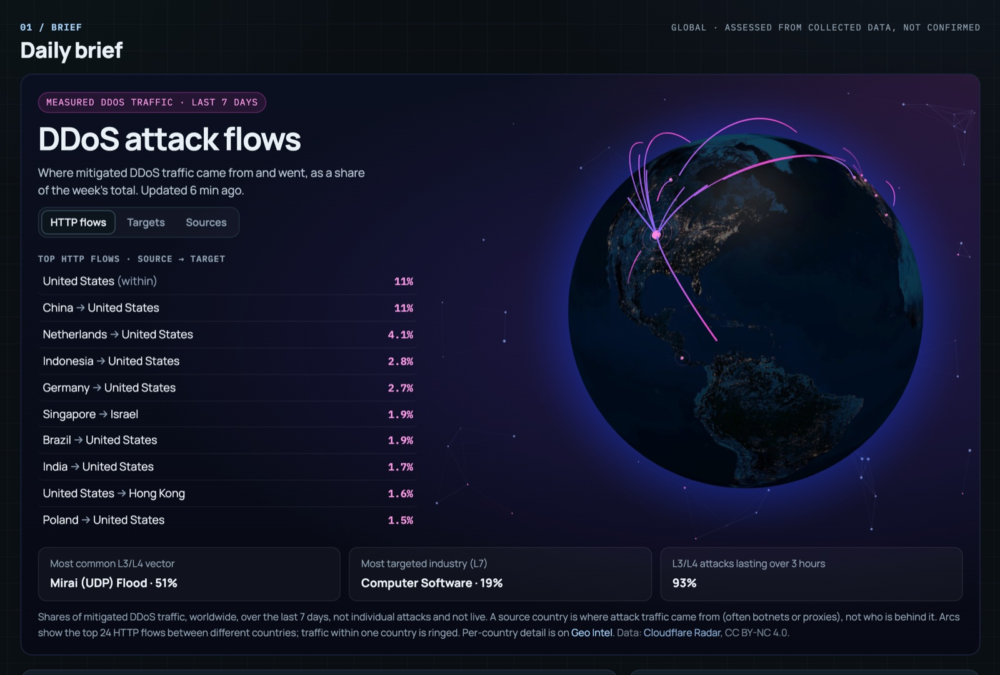

# Threat Intelligence: a standalone Cloudflare Worker app

An open-source threat intelligence dashboard that runs entirely on one Cloudflare Worker. It collects about 50 public sources on a schedule (news, government CERTs, CVE feeds, ransomware leak-site trackers, Telegram and Mastodon, abuse.ch, MISP, Cloudflare Radar, IODA) and presents them by region and country. Claims are shown as claims, never as confirmed incidents.



*The Brief page's DDoS attack flows card (measured traffic, last 7 days). Live: [cti-watch.threat-intel.workers.dev](https://cti-watch.threat-intel.workers.dev/)*

## What's in it

Every page follows one **region filter** (Global, APJ, Europe, N. America, S. America, Middle East, Africa). Most also follow a **time window** (7 days to 1 year). There's a dark theme (default) and a light theme, and a **source health** panel shows which feeds succeeded on the last run.

| Page | What it shows |
|---|---|
| **Brief** | The opening page. **DDoS attack flows**: a night-Earth globe with the week's top source → target countries for HTTP DDoS traffic, switchable to L3/L4 targets or sources, plus the most common attack vector, most targeted industry and attack duration. Below it, a written **daily brief** with key developments, a per-region snapshot, CISA KEV additions and top ATT&CK techniques. The brief downloads as Markdown. |
| **Geo Intel** | A world or region overview, or a profile for any country (`#country/IN`). Globe and flat map views of ransomware claims, a ticker and trend charts. DDoS intelligence puts three signals side by side and never merges them into one score: **claimed** (Telegram), **measured** (Cloudflare Radar) and **disrupted** (IODA outages). The page also lists news, curated actors and community posts for the place. |
| **Ransomware** | Leak-site claims from ransomware.live with its own metrics (new claims, unique organisations, active groups, watchlist matches), a clickable daily trend and top groups. Search plus group, country, sector, evidence and watchlist filters, pagination and CSV export. Claim and group panels separate the group's post date, discovery date, first-seen and last-listed. Evidence labels are actor claim, independently reported or social; leak-tracker mirror bots never count as corroboration. Community posts are deduplicated. |
| **Vulnerabilities** | NVD (CVSS 7+), GitHub Security Advisories and every recent CISA KEV entry, merged by CVE and scored with EPSS. It has a **priority queue** whose tiers are written out on the page (act now / likely exploited / severe / monitor), with reasons on every row, and a "known exploited: review regardless of EPSS" strip. Each CVE panel shows affected and fixed versions with their source, exploitation evidence, remediation and references. Evidence-based **edge (WAF) labels**: documented / potential / not applicable / unknown, each with its reason. A product watchlist and a collapsible CVSS × EPSS matrix complete the page. |
| **Telegram** | Posts from selected public Telegram channels, filterable by channel or self-claims. Kept apart from the vetted feeds because these channels are unmoderated. |
| **Actors** | Hand-curated profiles with typed relationships (alias, overlap, affiliate, association, disputed) and ATT&CK techniques using official names. Profiles open at shareable links like `#actors/apt41` and show live report mentions, leak-site claims, co-mentioned CVEs and tagged IOCs. A searchable, paginated **alias directory** of about 400 records comes from the community APT Groups and Operations sheet. **Activity trends** are measured from the app's own data. |
| **IOCs** | Raw indicators (hashes, IPs, domains, URLs) from abuse.ch URLhaus, ThreatFox and MalwareBazaar and CIRCL's MISP feed, ready to paste into a block-list. Also an on-demand IP reputation check (AbuseIPDB). |

Watchlists, followed actors, assessments and analyst notes are saved in your browser only (localStorage). Nothing is shared or sent anywhere.

## Data sources

| Source | Feeds | Key needed |
|---|---|---|
| 38 RSS/Atom feeds: news (BleepingComputer, The Hacker News, The Record, SecurityWeek…), government CERTs (CISA, NCSC UK, JPCERT/CC, ACSC, CERT-FR) and vendor research (Unit 42, Talos, Securelist, Microsoft, CrowdStrike, Recorded Future, The DFIR Report…) | Feed, brief, country tags | No |
| ransomware.live | Ransomware claims | No |
| NVD, GitHub Security Advisories, CISA KEV, FIRST EPSS | Vulnerabilities | No (`NVD_API_KEY` strongly recommended, see below) |
| OpenPhish community feed | Phishing summary | No |
| CIRCL MISP OSINT feed | IOCs | No |
| Public Telegram channels (CTI Now, Cyber Detective, AVLeonov, Ummah Sec, Hackmanac) | Telegram page, claims | No |
| Mastodon (#ransomware, @ransomwatch) | Community signals | No |
| IODA (Georgia Tech) | Internet outages | No |
| APT Groups and Operations sheet (Florian Roth, CC BY 4.0) | Alias directory | No |
| abuse.ch URLhaus, ThreatFox, MalwareBazaar | IOCs | `ABUSECH_AUTH_KEY` |
| Cloudflare Radar | DDoS flows, measured attack traffic | `CF_RADAR_TOKEN` |
| AbuseIPDB | IP reputation check | `ABUSEIPDB_API_KEY` |

## How it works

- **`src/worker.js`** is the whole backend. Three cron jobs (UTC, in `wrangler.toml`) write the collected data to Workers KV:
  - `*/30`: full collection (`collect()`): structured sources, ransomware.live, Telegram, Mastodon, abuse.ch, MISP, Radar, IODA.
  - `5,15,…,55`: CVE refresh (NVD, GitHub, KEV, EPSS), a rotating third of the RSS feeds, and an NVD backfill of 3 CVEs per run. These minutes are offset from the full job on purpose so the two never write at once.
  - `17 3 * * *`: daily check of the APT groups sheet (only re-parsed when it changes).
- **Nothing is fetched upstream when a page loads.** The frontend reads one cached blob, so it's fast and can't fail on an upstream timeout.

  | Endpoint | Purpose |
  |---|---|
  | `GET /api/data` | Everything the pages render |
  | `GET /api/actors` | APT sheet directory |
  | `GET /api/radar?cc=XX` | Per-country DDoS view, edge-cached 6 h |
  | `GET /api/ip-check?ip=` | AbuseIPDB lookup, edge-cached 6 h |
  | `POST /api/refresh` | Run a full collection on demand |
  | `POST /api/refresh-vulnerabilities` | Run the CVE refresh on demand |
  | `POST /api/refresh-actors` | Re-check the APT sheet on demand |
- **`public/`** is a static frontend (`index.html`, `styles.css`, `app.js`): no framework, no build step. Chart.js, topojson-client and globe.gl load from jsDelivr with SRI hashes.
- It fits the **Workers free plan**. One run may make 50 outbound requests, so sources are split across the two jobs to stay under that cap. Check both budgets before adding a source (see `CLAUDE.md`).

## Prerequisites

- A Cloudflare account (the free plan is enough)
- Node.js 18+
- Wrangler (installed by `npm install`; run it as `npx wrangler`)

## Setup

```bash
cd apj-threat-intel-app
npm install
npx wrangler login
```

Create the KV namespace the Worker uses to store collected data:

```bash
npx wrangler kv namespace create THREAT_DATA
```

Copy the `id` it prints into the `[[kv_namespaces]]` block in `wrangler.toml`:

```toml
[[kv_namespaces]]
binding = "THREAT_DATA"
id = "paste-the-id-here"
```

## Optional secrets

Everything works without these; each one switches on a feature. Set them on the deployed Worker with `npx wrangler secret put <NAME>`. For local development, copy `.dev.vars.example` to `.dev.vars` and fill in the same names.

| Secret | Enables | Where to get it |
|---|---|---|
| `REFRESH_KEY` | Requires an `x-refresh-key` header on the `POST /api/refresh*` endpoints | Any random string |
| `NVD_API_KEY` | Reliable NVD calls. Without it, NVD often rate-limits Workers' shared IPs and KEV entries stay unscored. | [nvd.nist.gov](https://nvd.nist.gov/developers/request-an-api-key) (free) |
| `CF_RADAR_TOKEN` | DDoS attack flows on the Brief and measured attack traffic on Geo Intel | Cloudflare dashboard → API Tokens → Custom token with Account › Radar › Read (free) |
| `ABUSECH_AUTH_KEY` | URLhaus, ThreatFox and MalwareBazaar | [auth.abuse.ch](https://auth.abuse.ch/) (free) |
| `ABUSEIPDB_API_KEY` | IP reputation check on the IOCs page | [abuseipdb.com](https://www.abuseipdb.com/account/api) (free, 1,000 checks/day) |

## Run locally

```bash
npm run dev
```

Open the printed `localhost` URL. Pages show "no data yet" until the first collection runs, so trigger one:

```bash
curl -m 180 -X POST http://localhost:8787/api/refresh
```

Add `-H "x-refresh-key: <value>"` if you set `REFRESH_KEY`. Give the request a long timeout: if the client gives up, Cloudflare cancels the collection with it.

## Deploy

```bash
npm run deploy
```

Wrangler prints your `*.workers.dev` URL. The cron jobs start collecting on their own; to get data right away:

```bash
curl -m 180 -X POST https://<your-worker>.workers.dev/api/refresh
```

`npm run tail` streams the deployed Worker's logs.

## Customizing

- **Sources**: RSS feeds are in `SOURCES`, Telegram channels in `TELEGRAM_CHANNELS`, both in `src/worker.js`. Read a Telegram channel's recent posts before adding it; `CLAUDE.md` lists the ways a plausible channel turns out to be wrong.
- **Countries and regions**: `REGION_CC` exists in both `src/worker.js` and `public/app.js` (keep them in sync), and `GEO_KW` holds the keywords that tag items to countries.
- **Curated actors**: `ACTORS` / `GLOBAL_ACTORS` in `public/app.js` are edited by hand. Keep the attribution-confidence wording. Use typed relationships (only `alias` means the same group) and official ATT&CK technique names. Bump `ACTORS_EDITED` when you edit.
- **Cron cadence**: `crons` in `wrangler.toml`. `scheduled()` matches the exact cron strings, so update `CVE_ONLY_CRON` / `APT_SHEET_CRON` in the Worker to match.
- **Custom domain**: add a `routes` entry in `wrangler.toml`, or attach a domain under Workers & Pages in the Cloudflare dashboard.

`CLAUDE.md` is the detailed maintainer guide to the code.

## Notes and caveats

- **Claims are not incidents.** Ransomware entries are posts on criminal leak sites, and Telegram posts are self-reported. The UI labels both as claims throughout.
- **DDoS data is a share of traffic, not a list of attacks.** Cloudflare Radar reports percentages of the attack traffic it mitigated over a period. A "source" country is where traffic came from (often botnets or proxies), not who is behind it. IODA sees that a network went dark, not why, so outages are shown as context, never as proof of an attack.
- **Mentions are not attribution.** Actor pages match names in reports. A CVE named in the same article is not evidence that the actor exploits it.
- **The INFOCON level** is read from the SANS Internet Storm Center feed, not computed by this app.
- **Retention is capped** so KV stays small. Each region keeps its newest ransomware claims (500 North America and Europe, 400 APJ, fewer elsewhere). Other stores are capped too: 1,500 feed items, 400 CVEs (every recent KEV first), 300 Telegram posts, 500 IOCs, all within a rolling 365 days. Trend charts say when a period isn't fully retained.
- **Licences of note**: Cloudflare Radar data is CC BY-NC 4.0 and must be credited. IODA data is © Georgia Tech Research Corporation; check their terms before any commercial use. The APT groups sheet is CC BY 4.0.
